alert(".mdfile"); 
//code 1........
//code2.........
//code3..........
//code4..........
## this is exercise 1
#### git push
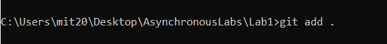
#####
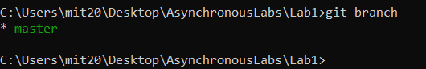
######
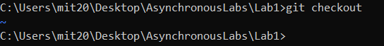
#######
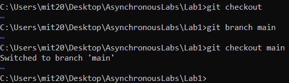
########
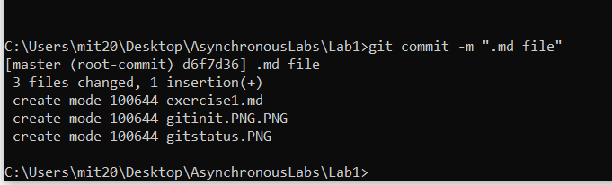
######
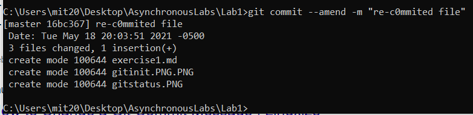
######
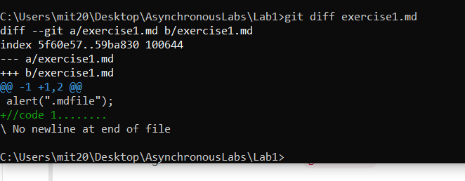
######
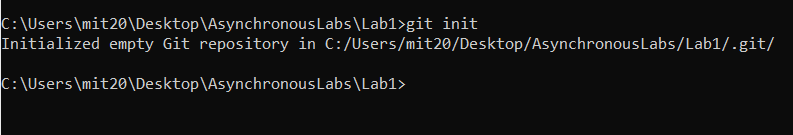
######
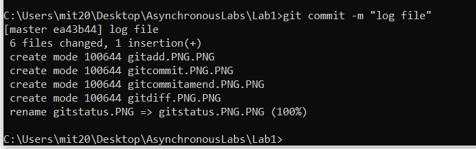
######
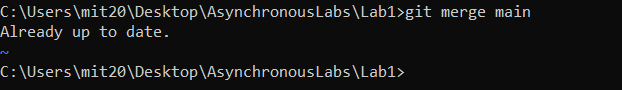
######
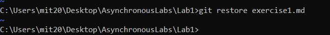
######
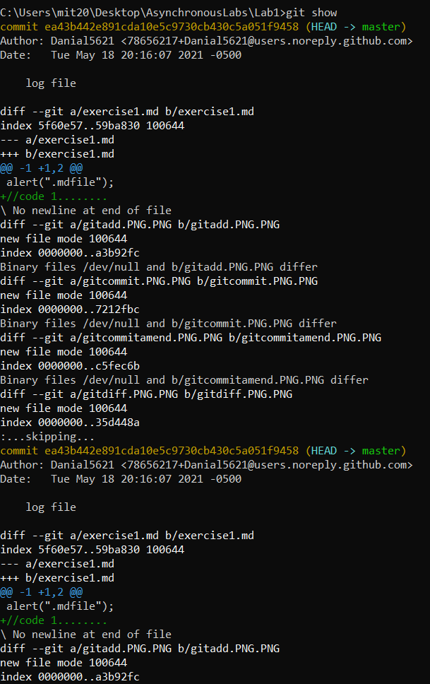
*
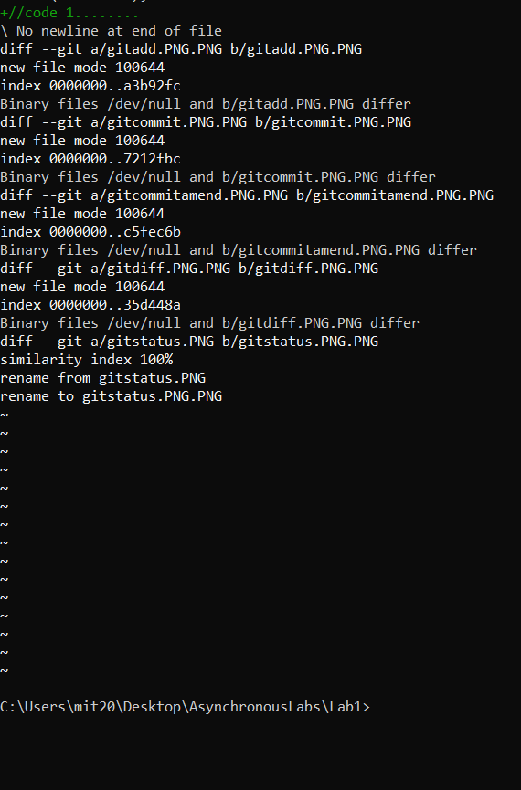
######
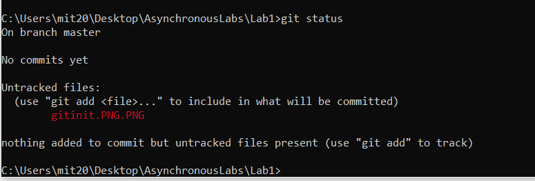
######
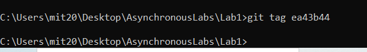
######
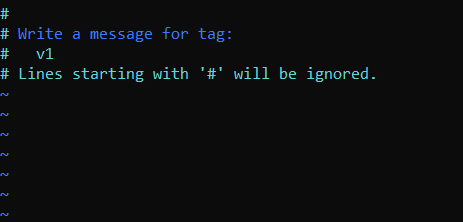